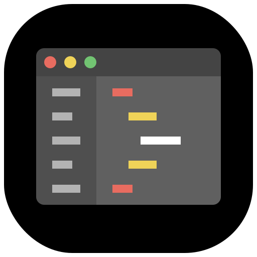
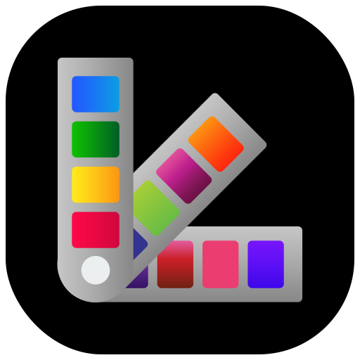

<p align="center" style="text-align:center">
	
</p>

# Sharedigm App Store

[Sharedigm](https://www.sharedigm.com) is a web based operating system, file sharing, and communications platform that allows you to manage and share your data and to communicate with your friends and colleagues.

The Sharedigm App store lets you install and uninstall apps to your [Sharedigm OS](https://github.com/Sharedigm/SharedigmOS) instance.  The Sharedigm App Store contains installation utilities to make it easy to install or uninstall apps from your Sharedigm instance.  This makes it easy for you to customize your Sharedigm platform to your own specific needs.

## Apps

The Sharedigm App Store contains the following apps:

### System Apps

The system apps allow you to use the core functionality of the system or to configure the system to your liking.

<p>
	<a href="apps/app-launcher">
		
		<b>App Launcher</b>
	</a>
	<p>The App Launcher app is used to launch (start / run) other applications.</p>
</p>

<p>
	<a href="apps/file-browser">
		
		<b>File Browser</b>
	</a>
	<p>The File Browser app lets you view, arrange, open, and manage your files.</p>
</p>

<p>
	<a href="apps/help-viewer">
		
		<b>Help Viewer</b>
	</a>
	<p>The Help Viewer app lets you browse the online help pages.</p>
</p>

<p>
	<a href="apps/notification-center">
		
		<b>Notification Center</b>
	</a>
	<p>The Notification Center app allows you to monitor and view your notifications.</p>
</p>

<p>
	<a href="apps/search-viewer">
		
		<b>Search Viewer</b>
	</a>
	<p>The Search Viewer app is used to search the content of files and posts.</p>
</p>

<p>
	<a href="apps/terminal">
		
		<b>Terminal</b>
	</a>
	<p>The Terminal app lets you interact via a simple command line.</p>
</p>

### Social Apps

Social apps are provided to allow you to connect with friends or colleages and to share messages, files, folders, photos, and music.

<p>
	<a href="apps/chat-browser">
		
		<b>Chat Browser</b>
	</a>
	<p>The Chat Browser app lets you view and manage your direct messaging chat sessions. </p>
</p>

<p>
	<a href="apps/chat-viewer">
		
		<b>Chat Viewer</b>
	</a>
	<p>The Chat Viewer app lets you view and post direct messages. </p>
</p>

<p>
	<a href="apps/communicator">
		
		<b>Communicator</b>
	</a>
	<p>The Communicator app lets you view and post news updates and exchange direct messages. </p>
</p>

<p>
	<a href="apps/connection-manager">
		
		<b>Connection Manager</b>
	</a>
	<p>The Connection Manager app lets you view and manage your connections with friends and colleagues. </p>
</p>

<p>
	<a href="apps/post-viewer">
		
		<b>Post Viewer</b>
	</a>
	<p>The Post Viewer app lets you view posts and their associated comments and replies. </p>
</p>

<p>
	<a href="apps/profile-browser">
		
		<b>Profile Browser</b>
	</a>
	<p>The Profile Browser app is used to find and connect with people you know. </p>
</p>

<p>
	<a href="apps/profile-viewer">
		
		<b>Profile Viewer</b>
	</a>
	<p>The Profile Viewer app is used to view personal profile information about you or your connections. </p>
</p>

<p>
	<a href="apps/topic-browser">
		
		<b>Topic Browser</b>
	</a>
	<p>The Topic Browser app lets you view discussion topics. </p>
</p>

<p>
	<a href="apps/topic-viewer">
		
		<b>Topic Viewer</b>
	</a>
	<p>The Topic Viewer app lets you view and post discussion topic comments and replies. </p>
</p>

### Multimedia Apps

Multimedia apps allow you to enjoy image, video, or audio media files.

<p>
	<a href="apps/audio-player">
		
		<b>Audio Player</b>
	</a>
	<p>The Audio Player app is used to play music and audio files (audiobooks, podcasts etc). </p>
</p>

<p>
	<a href="apps/image-viewer">
		
		<b>Image Viewer</b>
	</a>
	<p>The Image Viewer app lets you view your images and photo collections. </p>
</p>

<p>
	<a href="apps/map-viewer">
		
		<b>Map Viewer</b>
	</a>
	<p>The Map Viewer app lets you view and explore interactive maps. </p>
</p>

<p>
	<a href="apps/tune-editor">
		
		<b>Tune Editor</b>
	</a>
	<p>The Tune Editor app lets you view, create, and edit music notation documents. </p>
</p>

<p>
	<a href="apps/video-player">
		
		<b>Video Player</b>
	</a>
	<p>The Video Player app is used to view video files and movies. </p>
</p>

<p>
	<a href="apps/web-browser">
		
		<b>Web Browser</b>
	</a>
	<p>The Web Browser app lets you view and navigate websites. </p>
</p>

### Productivity Apps

Productivity apps help you with your work, allowing you to create or edit files and to manage projects.

<p>
	<a href="apps/code-editor">
		
		<b>Code Editor</b>
	</a>
	<p>The Code Editor app lets you read and write computer programming source code. </p>
</p>

<p>
	<a href="apps/contact-editor">
		
		<b>Contact Editor</b>
	</a>
	<p>The Contact Editor app lets you store, view, and share your contact information. </p>
</p>

<p>
	<a href="apps/pdf-viewer">
		
		<b>Pdf Viewer</b>
	</a>
	<p>The Pdf Viewer app lets you view .pdf (Portable Document Format) documents. </p>
</p>

<p>
	<a href="apps/project-browser">
		
		<b>Project Browser</b>
	</a>
	<p>The Project Browser app is used to manage your projects which are used for planning and prioritizing tasks. </p>
</p>

<p>
	<a href="apps/project-viewer">
		
		<b>Project Viewer</b>
	</a>
	<p>The Project Viewer app is used to manage a project's tasks. </p>
</p>

<p>
	<a href="apps/text-editor">
		
		<b>Text Editor</b>
	</a>
	<p>The Text Editor app lets you read and write simple text files. </p>
</p>

### Configuration Apps

The configuration apps allow you to configure the Sharedigm system and environment to suit your needs and aesthetics.

<p>
	<a href="apps/account-manager">
		
		<b>Account Manager</b>
	</a>
	<p>The Account Manager app is used to help an administrator to view and manage user accounts. </p>
</p>

<p>
	<a href="apps/settings-browser">
		
		<b>Settings Browser</b>
	</a>
	<p>The Settings Browser app lets you browse system settings and app preferences. </p>
</p>

<p>
	<a href="apps/settings-manager">
		
		<b>Settings Manager</b>
	</a>
	<p>The Settings Manager app lets you view and modify system settings and app preferences. </p>
</p>

<p>
	<a href="apps/theme-manager">
		
		<b>Theme Manager</b>
	</a>
	<p>The Theme Manager app lets you customize the look and feel of the user interface. </p>
</p>

<p>
	<a href="apps/theme-picker">
		
		<b>Theme Picker</b>
	</a>
	<p>The Theme Picker app lets you quickly apply a theme to change the look and feel of the user interface. </p>
</p>

### Utility Apps

Utility apps add basic additional functionality to make life just a little bit easier.

<p>
	<a href="apps/calculator">
		
		<b>Calculator</b>
	</a>
	<p>The Calculator app lets you conveniently perform algebraic, scientific, or computational calculations. </p>
</p>

<p>
	<a href="apps/calendar">
		
		<b>Calendar</b>
	</a>
	<p>The Calendar app allows you to keep track of your appointments. </p>
</p>

<p>
	<a href="apps/clock">
		
		<b>Clock</b>
	</a>
	<p>The Clock app displays the current time of day. </p>
</p>

<p>
	<a href="apps/decibel-meter">
		
		<b>Decibel Meter</b>
	</a>
	<p>The Decibel Meter app shows you the current audio level. </p>
</p>

<p>
	<a href="apps/timer">
		
		<b>Timer</b>
	</a>
	<p>The Timer app lets you time events, functioning as a simple stopwatch. </p>
</p>

## Requirements

### 1. Sharedigm OS

This application is built on top of the [Sharedigm cloud-based operating system](https://github.com/Sharedigm/SharedigmOS).

You will need an instance of the Sharedigm OS installed on your computer or web server in order to run this application.

### 2. Installer Requirements

The installer and uninstaller scripts for this applications require the following:

1. [bash](https://en.wikipedia.org/wiki/Bash_(Unix_shell)) - Unix style shell interpreter. 
2. [jq](https://jqlang.github.io/jq/) - command-line JSON processor. 
2. [sass](https://sass-lang.com) - CSS pre-processor

## Installation

In order to install an app to your Sharedigm instance, run the "install.sh" installation script:

### 1. Install a single app:

```
sh install-apps.sh SHAREDIGM_PATH APP_NAME
```

- Example:

```
sh install-apps.sh ~/Sites/sharedigm calculator
```

### 2. Install multiple apps:

```
sh install-apps.sh SHAREDIGM_PATH APP_NAME1 APP_NAME2 APP_NAME3...
```

- Example:

```
sh install-apps.sh ~/Sites/sharedigm calculator calendar clock
```

### 3. Install all apps:

```
sh install-apps.sh SHAREDIGM_PATH
```

- Example:

```
sh install-apps.sh ~/Sites/sharedigm
```

## Uninstallation
In order to uninstall an app from your Sharedigm instance, run the "install.sh" installation script:

### 1. Uninstall a single app:

```
sh uninstall-apps.sh SHAREDIGM_PATH APP_NAME
```

- Example:

```
sh uninstall-apps.sh ~/Sites/sharedigm calculator
```

### 2. Uninstall multiple apps:

```
sh uninstall-apps.sh SHAREDIGM_PATH APP_NAME1 APP_NAME2 APP_NAME3...
```

- Example:

```
sh install-apps.sh ~/Sites/sharedigm calculator calendar clock
```

### 3. Uninstall all apps:

```
sh uninstall-apps.sh SHAREDIGM_PATH
```

- Example:

```
sh install-apps.sh ~/Sites/sharedigm
```

<!-- LICENSE -->
## License

Distributed under the Sustainable Use License which allows urestricted use of the software but does not allow you to commercialize it. See [LICENSE.md](LICENSE.md) for more information.

<!-- CONTACT -->
## Contact

mailto:admin@sharedigm.com