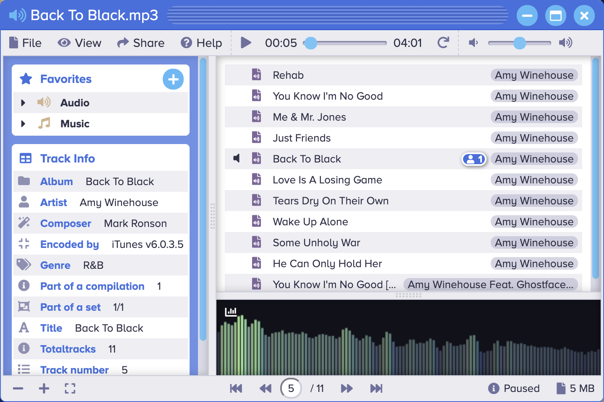

<p align="center" style="text-align:center">
	
</p>

# Audio Player

The [Audio Player](https://www.sharedigm.com/#apps/audio-player) app is used to play music and audio files (audiobooks, podcasts etc).

<p align="center" style="text-align:center">
	
</p>

## Features

- Play audio files in the following formats:
	- Free Lossless Audio Codec (.flac)
	- Mp3 (.mp3)
	- Mp4 Audio (.m4a, .m4p)
	- Wav (.wav)
- Use the navigation controls to play, pause, and repeat.
- Use the time slider to advance to a specific position in a track.
- Use the volume controls to adjust the volume.
- View track ID3 metadata including Album, Artist, Band, Composer, Genre, Track Length, Publisher, Track Number, and Year.
- Use the share menu to share favorite tracks with friends.
- View track Id3 metadata information.
- Save favorites in the sidebar for easy access.
- Visualize audio tracks using the audio analyzer.

## Benefits

- Allows you to play any track from your music collection from any network connected device. 
- Lets you move your music or podcast libraries to the cloud.

## Requirements

### 1. Sharedigm OS

This application is built on top of the [Sharedigm cloud-based operating system](https://github.com/Sharedigm/SharedigmOS).

You will need an instance of the Sharedigm OS installed on your computer or web server in order to run this application.

### 2. Installer Requirements

The installer and uninstaller scripts for this applications require the following:

1. [bash](https://en.wikipedia.org/wiki/Bash_(Unix_shell)) - Unix style shell interpreter. 
2. [jq](https://jqlang.github.io/jq/) - command-line JSON processor. 
2. [sass](https://sass-lang.com) - CSS pre-processor

## Installation

In order to install this application, simply run the included installation script:

```
sh install.sh SHAREDIGM_PATH
```

## Uninstallation

To uninstall this application, run:

```
sh uninstall.sh SHAREDIGM_PATH
```

<!-- LICENSE -->
## License

Distributed under the Sustainable Use License which allows urestricted use of the software but does not allow you to commercialize it. See [LICENSE.md](LICENSE.md) for more information.

<!-- CONTACT -->
## Contact

mailto:admin@sharedigm.com