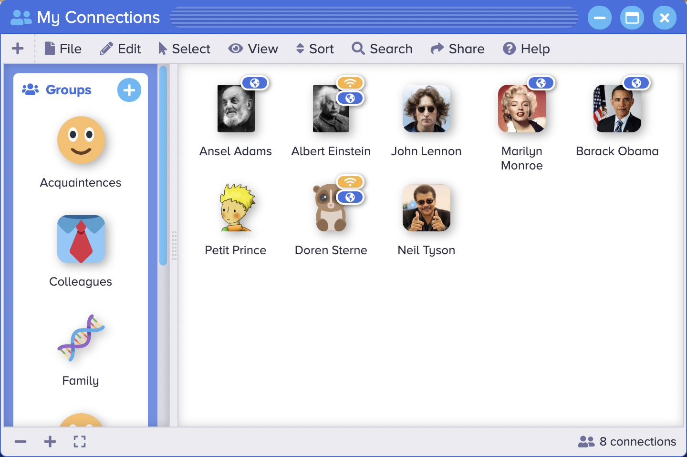

<p align="center" style="text-align:center">
	
</p>

# Connection Manager

The [Connection Manager](https://www.sharedigm.com/#apps/connection-manager) app lets you view and manage your connections with friends and colleagues.

<p align="center" style="text-align:center">
	
</p>

## Features

- View and sort connections by name, location occupation, age, gender, birth date.
- Find and invite new connections.
- View connections as icons, tiles, lists, or cards.
- Open items to view connections' profile information.
- Create groups and sort connections into groups by drag and drop.
- Use groups to quickly filter and select connections of a particular group.

## Benefits

- Easy to use - works a lot like the File Browser app.
- Grouping makes it easy to manage and view a large number of connections.

## Requirements

### 1. Sharedigm OS

This application is built on top of the [Sharedigm cloud-based operating system](https://github.com/Sharedigm/SharedigmOS).

You will need an instance of the Sharedigm OS installed on your computer or web server in order to run this application.

### 2. Installer Requirements

The installer and uninstaller scripts for this applications require the following:

1. [bash](https://en.wikipedia.org/wiki/Bash_(Unix_shell)) - Unix style shell interpreter. 
2. [jq](https://jqlang.github.io/jq/) - command-line JSON processor. 
2. [sass](https://sass-lang.com) - CSS pre-processor

## Installation

In order to install this application, simply run the included installation script:

```
sh install.sh SHAREDIGM_PATH
```

## Uninstallation

To uninstall this application, run:

```
sh uninstall.sh SHAREDIGM_PATH
```

<!-- LICENSE -->
## License

Distributed under the Sustainable Use License which allows urestricted use of the software but does not allow you to commercialize it. See [LICENSE.md](LICENSE.md) for more information.

<!-- CONTACT -->
## Contact

mailto:admin@sharedigm.com