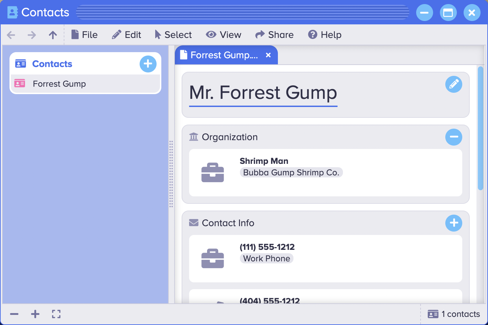

<p align="center" style="text-align:center">
	
</p>

# Contact Editor

The [Contact Editor](https://www.sharedigm.com/#apps/contact-editor) app lets you store, view, and share your contact information.

<p align="center" style="text-align:center">
	
	<div align="center">Contact Editor</div>
</p>

## Features

- Store contact names, affilations, phone numbers, addresses, email addresses, and websites.
- Import your contacts list from Google.
- Open contact info from any source using the standard .vcf (Variant Card Format) file format.

## Benefits

- Create, edit, and manage your contact information.
- Manage your contact information across all of your devices.
- A safer way of storing your contact information because you don't have to worry about losing your mobile device.

## Requirements

### 1. Sharedigm OS

This application is built on top of the [Sharedigm cloud-based operating system](https://github.com/Sharedigm/SharedigmOS).

You will need an instance of the Sharedigm OS installed on your computer or web server in order to run this application.

### 2. Installer Requirements

The installer and uninstaller scripts for this applications require the following:

1. [bash](https://en.wikipedia.org/wiki/Bash_(Unix_shell)) - Unix style shell interpreter. 
2. [jq](https://jqlang.github.io/jq/) - command-line JSON processor. 
2. [sass](https://sass-lang.com) - CSS pre-processor

## Installation

In order to install this application, simply run the included installation script:

```
sh install.sh SHAREDIGM_PATH
```

## Uninstallation

To uninstall this application, run:

```
sh uninstall.sh SHAREDIGM_PATH
```

<!-- LICENSE -->
## License

Distributed under the Sustainable Use License which allows urestricted use of the software but does not allow you to commercialize it. See [LICENSE.md](LICENSE.md) for more information.

<!-- CONTACT -->
## Contact

mailto:admin@sharedigm.com