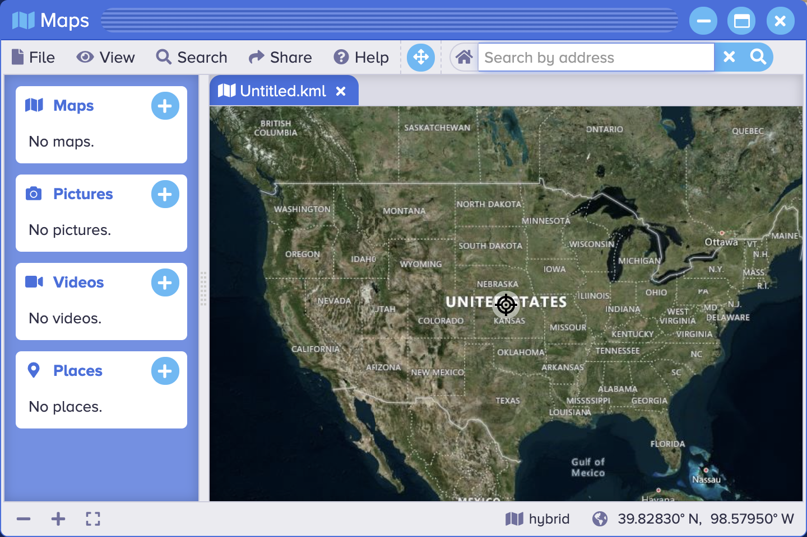

<p align="center" style="text-align:center">
	
</p>

# Map Viewer

The [Map Viewer](https://www.sharedigm.com/#apps/map-viewer) app lets you view and explore interactive maps.

<p align="center" style="text-align:center">
	
	<div align="center">Map Viewer</div>
</p>

## Features

- View maps in a variety of modes:
	- Map
	- Satellite
	- Hybrid
	- Streets
	- Transportation
	- Elevation
	- Aeronautical
- Search maps by:
	- Coordinates
	- Address
- Measure distances between locations. Choose between:
	- Metric units (km)
	- Imperial units (miles)
- Easy to use pan and zoom controls.
- Add and manage place markers.

## Benefits

- Allows you to view and explore the world.
- View your images, videos, and connections by geolocation.

## Requirements

### 1. Sharedigm OS

This application is built on top of the [Sharedigm cloud-based operating system](https://github.com/Sharedigm/SharedigmOS).

You will need an instance of the Sharedigm OS installed on your computer or web server in order to run this application.

### 2. Installer Requirements

The installer and uninstaller scripts for this applications require the following:

1. [bash](https://en.wikipedia.org/wiki/Bash_(Unix_shell)) - Unix style shell interpreter. 
2. [jq](https://jqlang.github.io/jq/) - command-line JSON processor. 
2. [sass](https://sass-lang.com) - CSS pre-processor

## Installation

In order to install this application, simply run the included installation script:

```
sh install.sh SHAREDIGM_PATH
```

## Uninstallation

To uninstall this application, run:

```
sh uninstall.sh SHAREDIGM_PATH
```

<!-- LICENSE -->
## License

Distributed under the Sustainable Use License which allows urestricted use of the software but does not allow you to commercialize it. See [LICENSE.md](LICENSE.md) for more information.

<!-- CONTACT -->
## Contact

mailto:admin@sharedigm.com