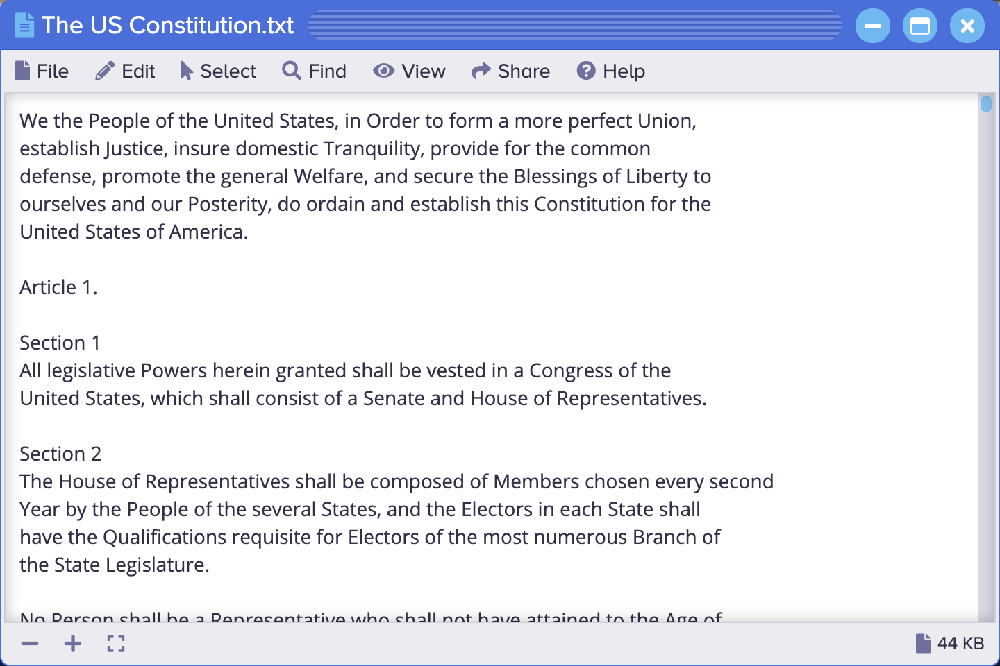

<p align="center" style="text-align:center">
	
</p>

# Text Editor

The [Text Editor](https://www.sharedigm.com/#apps/text-editor) app lets you read and write simple text files.

<p align="center" style="text-align:center">
	
	<div align="center">Text Editor</div>
</p>

## Features

- Select text by word, line, or paragraph.
- Cut, copy, and paste text to and from other documents.
- Use find and replace to search and replace text.

## Benefits

- Lets you keep notes in the cloud that you can read and write from any network connected device.

## Requirements

### 1. Sharedigm OS

This application is built on top of the [Sharedigm cloud-based operating system](https://github.com/Sharedigm/SharedigmOS).

You will need an instance of the Sharedigm OS installed on your computer or web server in order to run this application.

### 2. Installer Requirements

The installer and uninstaller scripts for this applications require the following:

1. [bash](https://en.wikipedia.org/wiki/Bash_(Unix_shell)) - Unix style shell interpreter. 
2. [jq](https://jqlang.github.io/jq/) - command-line JSON processor. 
2. [sass](https://sass-lang.com) - CSS pre-processor

## Installation

In order to install this application, simply run the included installation script:

```
sh install.sh SHAREDIGM_PATH
```

## Uninstallation

To uninstall this application, run:

```
sh uninstall.sh SHAREDIGM_PATH
```

<!-- LICENSE -->
## License

Distributed under the Sustainable Use License which allows urestricted use of the software but does not allow you to commercialize it. See [LICENSE.md](LICENSE.md) for more information.

<!-- CONTACT -->
## Contact

mailto:admin@sharedigm.com