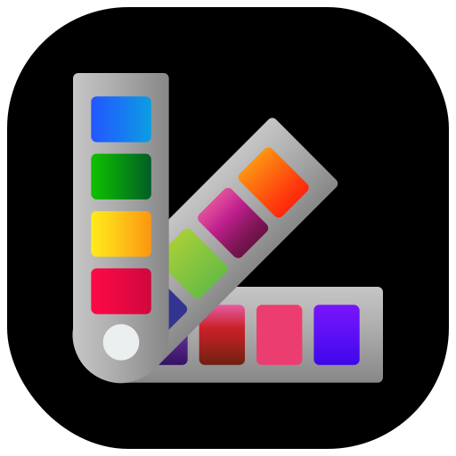
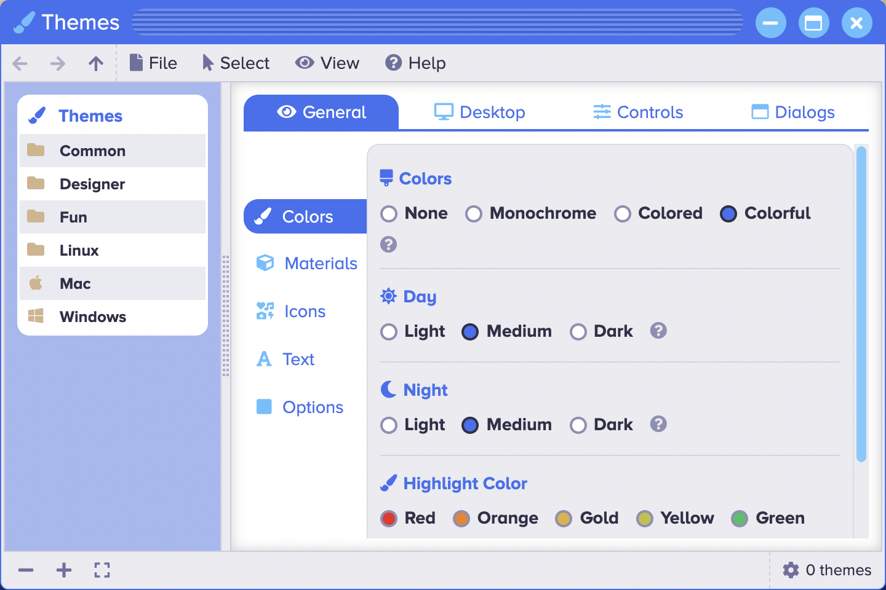

<p align="center" style="text-align:center">
	
</p>

# Theme Manager

The [Theme Manager](https://www.sharedigm.com/#apps/theme-manager) app lets you customize the look and feel of the user interface.

<p align="center" style="text-align:center">
	
</p>

## Features

- Apply pre-existing themes to change groups of settings.
- Create and save your own themes.
- View and modify theme settings including:
	- Type of app launcher to use (task bar, dock bar, or run menu)
	- Color scheme
	- Background color, image, size, and repeats
	- Material attributes (none, chalk, plastic, glass, metal)
	- Dialog transparency
	- Icon labels
	- Font family and size

## Benefits

- Customize your environment to suit your personal style and preferences.
- Make your environment look like your favorite computing environment or make it look like something new.

## Requirements

### 1. Sharedigm OS

This application is built on top of the [Sharedigm cloud-based operating system](https://github.com/Sharedigm/SharedigmOS).

You will need an instance of the Sharedigm OS installed on your computer or web server in order to run this application.

### 2. Installer Requirements

The installer and uninstaller scripts for this applications require the following:

1. [bash](https://en.wikipedia.org/wiki/Bash_(Unix_shell)) - Unix style shell interpreter. 
2. [jq](https://jqlang.github.io/jq/) - command-line JSON processor. 
2. [sass](https://sass-lang.com) - CSS pre-processor

## Installation

In order to install this application, simply run the included installation script:

```
sh install.sh SHAREDIGM_PATH
```

## Uninstallation

To uninstall this application, run:

```
sh uninstall.sh SHAREDIGM_PATH
```

<!-- LICENSE -->
## License

Distributed under the Sustainable Use License which allows urestricted use of the software but does not allow you to commercialize it. See [LICENSE.md](LICENSE.md) for more information.

<!-- CONTACT -->
## Contact

mailto:admin@sharedigm.com